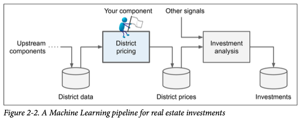

# 2. End-to-End ML Project

## Working with Real Data

The main steps author goes through in this chapter are:

1. Look at the big picture.
2. Get the data.
3. Discover and visualize the data to gain insights.
4. Prepare the data for Machine Learning algorithms.
5. Select a model and train it.
6. Fine-tune your model.
7. Present your solution.
8. Launch, monitor, and maintain your system.

In this chapter, the author goes through a project in which the goal is to predict the median housing price in any district for the Californa Housing Prices [dataset](https://www.kaggle.com/camnugent/california-housing-prices). 

You are pretending to be a recently hired Data Scientist at a real estate company. Following the steps above you are expected to create a machine learning model that will be fed to another ML system, along with many other signals \(he refers to a piece of information as a **signal**\). Below is an example visualization of an ML pipeline for real estate investments.


**Pipelines:** A sequence of data processing components is called a data _pipeline_. Pipelines are de facto standards of Machine Learning systems since there is a lot of data to preprocess and various transformations to apply.



**Multiple Regression:**  A regression model that consists of multiple features called a _multiple \(univariate if one target variable\) regression model_. 

\( multiple-univariate regression $$ \rightarrow y = w_1 x_1 + ... + w_n x_n + b)$$

**Multivariate Regression:** A regression model in which the numbers of target variables are more than one is called a _multivariate regression model_. 

\( multivariate-multiple $$ \rightarrow y_1 = W_1 X + b_1)$$

                                        $$ \rightarrow \dots  \dots  \dots  \dots   \dots$$

                                        $$ → y_n= W_n X +b_n)$$ where $$X$$ is feature matrix.


## Select a Performance Measure

In the book, the prediction of sample$$i$$is represented by $$ \hat{y}^{(i)} = h (x^{(i)}).$$ We will use $$ \hat{y}^{(i)}.$$Some of the most common loss functions used in regression problems \(I included more\): 

**Mean Squared Error:**         $$ \text{MSE} = \dfrac{1}{m} \sum\limits_{i=1}^{m} (y^{(i)} - \hat{y}^{(i)})^2 = \dfrac{1}{m} ||y^{(i)} - \hat{y}^{(i)}||_{\ell^2}^2 $$\*\*\*\*

This is simply a rescaled version of a squared $$\ell^2$$ \(Euclidean\) norm of the error vector.

**Root Mean Square Error:** $$ \text{RMSE} =  \sqrt{\dfrac{1}{m}\sum\limits_{i=1}^{m} (y^{(i)} - \hat{y}^{(i)})^2} = \dfrac{1}{\sqrt{m}} ||y^{(i)} - \hat{y}^{(i)}||_{\ell^2}$$\*\*\*\*

Again, this is another rescaled version of an $$\ell^2$$ \(Euclidean\) norm of the error vector.

**Mean Absolute Error:**  $$\text{MAE} = \dfrac{1}{m} \sum\limits_{i=1}^{m} |y^{(i)} - \hat{y}^{(i)}| = \dfrac{1}{m} ||y^{(i)} - \hat{y}^{(i)}||_{\ell^1}$$\*\*\*\*

This error is a rescaled version of an $$\ell^1$$\(Manhattan\) norm of the error vector.

**Root Mean Absolute Error:**  $$\text{MAE} = \sqrt{\dfrac{1}{m} \sum\limits_{i=1}^{m} |y^{(i)} - \hat{y}^{(i)}| }= \sqrt{\dfrac{1}{m} ||y^{(i)} - \hat{y}^{(i)}||_{\ell^1}}$$\*\*\*\*

This error is a rescaled version of a square root of$$\ell^1$$\(Manhattan\) norm of the error vector.

