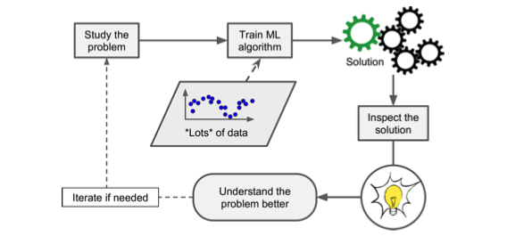
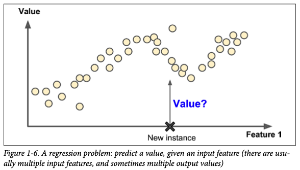
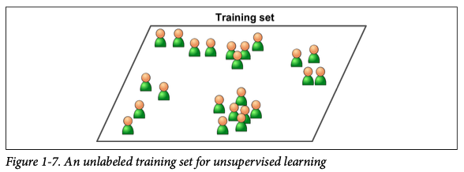
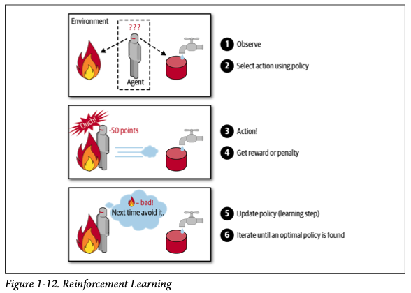

# 1. The ML Landscape

## **What is Machine Learning?**


**Basic:** Machine Learning is the science of programming computers so they can _learn from data_.



**General:** Machine Learning is the field of study that gives computers the _ability to learn without being explicitly programmed_. — Arthur Samuel, 1959



**Engr-oriented:** A computer program is said to _learn_ from _experience_ **E** with respect to some _task_ **T** and some _performance measure_ **P**, if its _performance_ on **T**, as _measured_ by **P**, _improves with experience_ **E**. — Tom Mitchell, 1997


Some of the applications of Machine Learning are:

* Forecasting revenue for the next year, based on past performance metric \(**regression**\)
* Detecting tumors in brain scans \(**classification** - semantic segmentation\)
* Segmenting clients based on their purchasing behaviors \(**clustering**\)
* Detecting fraudulent credit card transactions \(**anomaly detection**\)
* Recommending a product to clients based on past purchases \(**recommender system**\)
* Automatically classifying news articles \(**natural language processing**\)
* Analyzing images of products to automatically classify them \(**image classification**\)
* Creating an app to react to voice commands \(**speech recognition**\)
* Building intelligent bots for games \(**reinforcement learning**\), etc.

## Types of ML Systems

There are multiple types of Machine Learning systems that it is often useful to classify them based on the following criteria:

* Whether or **not** they are trained with **human supervision** 
  * _supervised, unsupervised, semi-supervised_, and _reinforcement learning_
* Whether or **not** they can **learn** incrementally **on the fly**
  * _online_ vs. _batch learning_
* Whether they work by simply **comparing** **new** data points **to known** data points, or instead by **detecting patterns** in the training data and **building a predictive model**
  * _instance-based_ vs. _model-based learning_


These criteria are **not exclusive**; you can combine them in any way you like. For example, a state-of-the-art spam filter may learn on the fly using a DNN model trained using examples of spam and ham; this makes it an **online**, **model- based**, **supervised** learning system.


### Supervised Learning

In **supervised learning,** the training set fed into an algorithm includes the desired solutions \(target variable\) called _labels_, beforehand.

Typical supervised learning tasks are **regression** and **classification** whose target variables consist of _numerical_ and _categorical_ variables, responsively. 

An example of a **regression** problem would be predicting the price of a car, where given a set of _features_ \(mileage, age, brand, etc.\), called _predictors_, the task is to predict a _target_ numeric value. 

An example of a **classification** problem would be a spam filter, where the training samples are given along with their \(binary\) class: _spam_ or _ham_ \(1 or 0\). 

Below are some of the most important supervised learning algorithms:

* Linear Regression
* Logistic Regression
* k-Nearest Neighbors \(kNN\)
* Support Vector Machines \(SVM\)
* Decision Trees and Random Forests
* Neural Networks, etc.


**Note 1:** Some of the algorithms - such as Random Forests - can be used for both _regression_ and _classification_ problems.



**Note 2:** Some neural network architectures can be _unsupervised_, such as _autoencoders_ and _restricted Boltzmann machines_. They can also be _semi-supervised_, such as in _deep belief networks_ and _unsupervised pretraining_.


### Unsupervised Learning

In contrast to _supervised_ learning, in **unsupervised** **learning** the training data is unlabeled. The algorithms try to learn without human supervision.

Here are some of the most important unsupervised learning algorithms:

* Clustering
  *  K-Means
  * DBSCAN
  * Hierarchical Cluster Analysis \(HCA\)
* Anomaly detection and novelty detection
  * One-class SVM
  * Isolation Forest
* Visualization and dimensionality reduction
  * Principal Component Analysis \(PCA\)
  * Kernel PCA
  * Locally Linear Embedding \(LLE\)
  * t-Distributed Stochastic Neighbor Embedding \(t-SNE\)
* Association rule learning
  * Apriori
  * Eclat

If you have a lot of data about your website's visitors, you can use **clustering** algorithms to try to detect the groups of similar visitors. Using a **hierarchical clustering** algorithm, you may also divide each group into smaller groups.

**Anomaly detection** can be used for detecting unusual credit card transactions to prevent fraudulent activities and alert customers to take action. A similar task is **novelty detection**, which targets to detect new instances that look from the rest of the instances in the training set.

**Visualization** and **dimensionality reduction** algorithms are good examples of unsupervised learning since you feed them a lot of complex and unlabeled data and they output smaller dimensions, often in 2D or 3D, representation of the data that can easily be plotted. These algorithms try to preserve the structure of the data \(or minimize the loss of information\) in order to help you understand how the data is organized and identify unusual patterns.


It is often a good idea to try to r**educe the dimension** of your training data using a dimensionality reduction algorithm before you feed it to another Machine Learning algorithm \(such as a super‐ vised learning algorithm\). It will run much **faster**, the data will take up **less** **disk** and **memory space**, and in some cases, it may also _perform better_.


Finally, another common unsupervised task is association **rule learning**, in which the goal is to dig into large amounts of data and discover interesting relations between attributes.

### Semi-supervised Learning

Notice, labeling data is usually _time-consuming_ and _costly,_ as a result often you will end up with plenty of _unlabeled_ instances, and few _labeled_ instances. Some algorithms can deal with data that’s partially labeled. These are called **semi-supervised learning** algorithms.

Most semi-supervised learning algorithms are combinations of **unsupervised** and **supervised** algorithms. For example, _deep belief networks_ \(DBNs\) are based on _unsupervised_ components called _restricted Boltzmann machines_ \(RBMs\) stacked on top of one another. RBMs are trained sequentially in an _unsupervised_ manner, and then the whole system is fine-tuned using _supervised_ learning techniques.

### Reinforcement Learning

In **Reinforcement Learning,** the learning system - called an **agent** - can observe the environment, select and perform actions to maximize rewards and/or minimize penalties. At its final stage, the agent must learn the best strategy - called a **policy** - to maximize reward over time. A _policy_ defines the action which should be taken in a given situation.

For example, robots - in general - implement _Reinforcement Learning_ algorithms to learn how to walk. DeepMind’s **AlphaGo** program is also a good example of RL: It beat the world champion Ke Jie at the game of Go, by learning its winning policy after analyzing millions of games and then playing many games against itself. Learning was turned off during the games; AlphaGo was just applying the _policy_ it had _learned_.

### Batch and Online Learning

